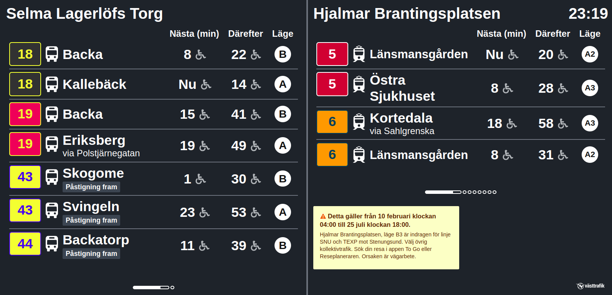

<!DOCTYPE html>
<html lang="sv">
<head>
    <meta charset="UTF-8">
    <meta name="viewport" content="width=device-width, initial-scale=1.0">
    <link rel="manifest" href="/manifest.json">
    <title>Min Personliga anslagstavla</title>
    
</head>
<body>
    

        
        Personlig anslagstavla

    

    

        

            

                
                
Klicka för att förstora

            

            

                
                
Klicka för att förstora

            

        

        <button onclick="openConfig()">Ställ in din tavla</button>
        

            
Hämta din länk genom att öppna Västtrafiks inställnings sida

            
Sök och lägg till hållplats (du kan välja upp till två stycken)

            
Kopiera den genererade länken som börjar med https://avgangstavla.vasttrafik.se/

            
Klistra in länken i fältet nedan och klicka på "Spara" för att visa din tavla

        

        <input type="text" id="linkInput" placeholder="Klistra in din länk här...">
        <button onclick="saveLink()">Spara</button>
        <button onclick="goBackToConfig()" style="display: none;" id="backButton">Tillbaka till konfigurering</button>
        <button onclick="installApp()" style="display: none;" id="installButton">Installera som app</button>
    

    

        ×
        
    

    
</body>
</html>
